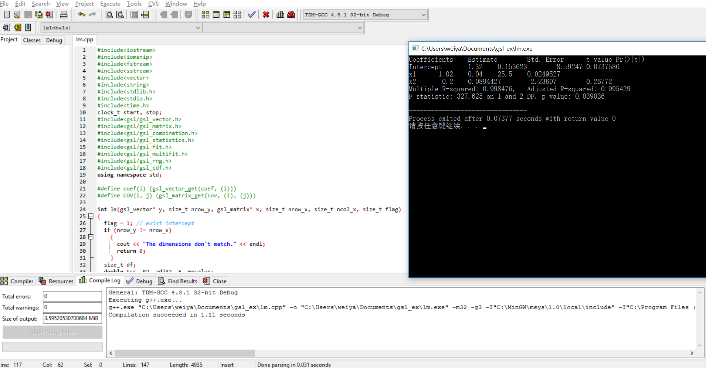

# GSLwin
GSL for windows.

## Steps

1. Download [MinGW](www.mingw.org) and install.
2. In MinGW Installation Manager, choose all packages in basic setup and install.
3. In cmd, type 'msys.bat MSYS' to open a unix-like terminal.
4. Download [gsl](ftp://ftp.gnu.org/gnu/gsl/) to the file folder of MSYS.
5. In the unix-like terminal, type

```
cd gsl-2.4/
./configure
make
make install
```
6. The lib is in 'local/lib', and the include is in 'local/include'
7. Now, you can use gsl on windows.
```
g++ test.c -o out I"path/to/include" -L"path/to/lib" -lgsl -lgslcblas -lm
```

NOTE: The include and lib in this repository are just for i386.

## Setup Dev-C++
1. Choose Tools>Compiler Options>Directories, then add the include and libraries path for gsl.

2. Choose Tools>Compiler Options>General, add the following commands when calling the linker
```
-lgsl -lgslcblas -lm
```

3. Compile and build a C/C++ program, say [lm.cpp](https://github.com/szcf-weiya/gsl_lm)

The results are as follows:


